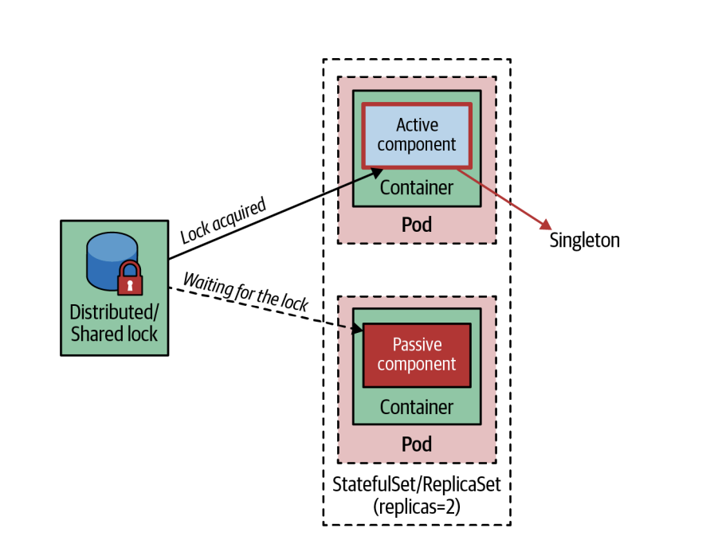

# 싱글톤 서비스(Singleton Service)
> 싱글톤 서비스 패턴은 동시에 하나의 애플리케이션 인스턴스만 활성화하지만 고가용성을 보장하며 애플리케이션 레벨의 구현 말고도 쿠버네티스에 모두 위임할 수 있음

## 문제
- 쿠버네티스가 제공하는 주요 기능 중 하나는 애플리케이션을 손쉽게 확장하는 기능
- 동일한 서비스의 다중 인스턴스를 실행해 시스템의 처리량과 가용성을 높임
- 어떤 경우에는 동시에 하나의 서비스 인스턴스만 실행되어야 할 수 있음
  - ex. 
    - 주기적으로 실행되는 동일한 서비스의 다중 인스턴스가 있을 때 중복 작업이 수행되는 경우
    - 특정 자원에 대해 폴링(polling)을 수행하는 서비스
    - 메시지 브로커로부터 단일 스레드 컨슈머가 순차적으로 메시지를 가져와야 할 때

> 싱글톤 서비스 패턴은 이와 같은 상황에서 이미 실행 중인 인스턴스 개수와는 관계 없이 동시에 활성화되는 인스턴스 개수에 대한 제어를 가능하게 만듦

## 해결책
- 액티브-패시브(active-passive)나 마스터-슬레이브(master-slave) 토폴로지를 구성해야 함
- 이는 애플리케이션 외부 잠금(out-of-application locking)과 애플리케이션 내부 잠금(in-application locking)으로 구현할 수 있음

### 애플리케이션 외부 잠금
- 애플리케이션 외부의 관리 프로세스를 사용해서 오직 애플리케이션 하나의 인스턴스만 실행되게 함
- 하나의 파드만 갖는 스테이트풀셋이나 레플리카셋을 사용해 구현
  - 정확하게 액티브-패시브 토폴로지는 아니지만 항상 하나의 파드가 실행되도록 보장해주기 때문에 동일한 효과가 있음
  - 단일 파드의 고가용성을 유지
- 언제든지 레플리카 수를 변경할 수 있기 때문에 주의해야 함
- 레플리카 수는 '최대한'이 아닌 '최소한'의 의미기 때문에 이것을 1로 설정하더라도 간혹 그보다 더 많은 파드가 실행될 수 있음
  - ex. 레플리카셋(혹은 스테이트풀셋)으로 실행 중인 파드가 실행중인 노드에 문제가 생겼을 경우에 정상적인 노드에 새로운 파드 인스턴스를 시작하는 경우
- 가용성보다 일관성을 선호하는 엄격한 싱글톤 보장을 하기 위해선 스테이트풀셋을 사용
- 싱글톤으로 구성된 파드를 외부에서 연결을 받기 위해선 헤드리스 서비스(headless Service)를 생성하는 것이 좋음
  - 해당 서비스에 대한 DNS 조회는 가상 IP 대신에 파드 IP 주소를 반환
  - `my-singleton` 이라는 헤드리스 서비스를 생성하면, `my-singleton.default.svc.cluster.local`로 접근할 수 있음

> 엄격하지 않은 싱글톤의 경우에는 레플리카셋, 엄격한 싱글톤과 더 좋은 성능의 서비스 디스커버리를 필요로 하는 경우라면 스테이트풀셋과 헤드리스의 조합을 사용하는게 적합

### 애플리케이션 내부 잠금
- 분산 환경에서 애플리케이션을 제어하는 한 가지 방법은 분산 락(distributed lock)을 사용하는 것
  - ex. Apache ActiveMQ는 데이터 소스가 공유 락을 제공하는 고가용성 액티브-패시브 토폴로지에서 실행될 수 있음
    
- 분산 환경에서 액티브-액티브 토폴로지를 허용하지 않는 방식을 구현하려면 Apache ZooKeeper, HashiCorp's Consul, Redis, Etcd에서 제공하는 것과 같은 분산 락 구현이 필요

### 파드 디스럽션 버짓(Pod Disruption Budget)
- 싱글톤과는 반대로 유지 보수를 위해 동시에 다운되는 인스턴스 수를 제한
- 일정 수나 일정 비율의 파드가 임의의 한 시점에 노드에서 자발적으로 축출되지 않게 보장
  - 여기서의 자발적 의미는 클러스터 스케일 다운 혹은 업그레이드나 유지보수를 위해 노드를 드레인(`kubectl drain`)함으로써 발생하는 경우
- `spec.maxUnavailable`을 사용하는 옵션도 있으며 `spec.minAvailable` 과는 반대 개념으로, 축출 후에 불가용하게 될 파드의 수를 지정
- 파드 디스럽션 버짓 기능은 쿼럼을 보장하기 위해 항상 실행 중인 최소의 레플리카 수를 요구하는 쿼럼(quorum)기반 애플리케이션에 유용
- 애플리케이션이 전체 인스턴스 수의 특정 비율 아래로는 절대 떨어지지 않아야 하는 중요한 트래픽을 처리할 때도 유용

## 정리
- 애플리케이션 내부 잠금은 외부 잠금과는 다르게 실수로 레플리카 수를 변경해 파드가 확장되는 것을 막아줌
- 컨테이너화된 애플리케이션의 일부만 싱글톤이어야 함
  - ex. HTTP 프로토콜을 제공하는 REST API의 경우에 애플리케이션은 다중 인스턴스로 확장해야 하지만, 폴링 컴포넌트는 싱글톤이어야 함
- 애플리케이션 외부 잠금 방법을 사용하면 전체 서비스를 확장할 수 없음

> 싱글톤 컴포넌트를 분리하거나, 싱글톤 컴포넌트만 락을 거는 애플리케이션 내부 잠금 메커니즘을 활용하여 전체 애플리케이션을 확장하고, 또 다른 부분을 액티브-패시브 싱글톤으로 만들 수 있음