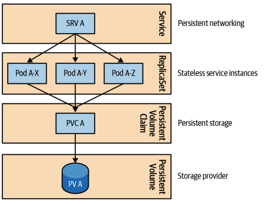

# 스테이트풀 서비스
> 스테이트풀 애플리케이션 관리에 이상적이고 강력한 보장을 해주는 스테이트풀셋(StatefulSet) 기본 요소를 설명

## 문제
- 쿠버네티스 기본 요소(컨테이너, 파드, 잡, 싱글톤 등등...)의 공통적인 특징
  - 교체 가능하며 대체 가능한 컨테이너로 구성된 스테이트리스 애플리케이션으로 취급
  - 12요소 애플리케이션(Twelve-Factor App)원칙을 준수
- 스테이트풀 애플리케이션의 모든 인스턴스는 고유하며 오래 지속되는 특성을 지님
- 고려해야 할 상당 부분의 워크로드가 스테이트풀 애플리케이션
- 확장성이 뛰어난 모든 스테이트리스 서비스 뒤에는 일반적인 데이터 저장소 형태의 스테이트풀 서비스가 있음
- 초창기 쿠버네티스는 스테이트리스 애플리케이션을 쿠버네티스에 배치하고, 클러스터 외부에 스테이트풀 컴포넌트를 배치
  - 지원이 부족해서
- 레플리카가 하나인 레플리카셋을 지정하여 스테이트풀 애플리케이션을 사용하면 일시적으로 레플리카 수가 달라질 수 있기 때문에 올바르지 않음

### 스테이트풀셋이 없다면?
- 스토리지
  - 분산 스테이트풀 애플리케이션엔 전용 퍼시스턴스 스토리지가 필요
  - 스테이트풀셋이 없다면?
    - 레플리카셋 구성을 사용하고, 하나의 공유 스토리지에서 하위 폴더로 분할해 충돌 없이 사용하기 때문에 단일 장애 지점이 생김
    - 각각 별도의 레플리카셋을 갖는 다면 모든 레플리카셋에 PVC와 전용 스토리지가 있어야 하기 때문에 수동 작업이 많아짐

- 네트워킹
  - 분산 스테이트풀 애플리케이션에는 안정적인 네트워크 식별자가 필요
  - 레플리카셋 파드 IP 주소처럼 동적으로 변경되면 안 되고, 예측 가능한 주소가 필요
  - 하나의 레플리카를 레플리카셋에 서비스를 구성하여 해결할 수 있지만, 호스트 네임이 재시작할 때마다 변경되어 매번 수동 작업으로 설정 관리해야 함

- 식별자
  - 스테이트풀 애플리케이션은 스토리지 및 네트워크 식별자를 가진 모든 인스턴스에 크게 의존
  
- 순서성
  - 스테이트풀 애플리케이션은 인스턴스 컬렉션에서 위치가 고정되어 있어야 함
  - 인스턴스 컬렉션의 순서가 스케일 업 및 다운되는 순서에 영향을 주기 때문

> 안정적이고 오래 지속되는 스토리지, 식별자, 순서성(ordinality) 등은 스테이트풀 애플리케이션이 공통적으로 요구하는 사항

## 해결책
### 스테이트풀셋 구성을 한 경우
- 스토리지
  - 사전에 정의된 PVC를 참조하는 대신, 파드를 생성할 때 `volumeClaimTemplates`를 사용하여 PVC를 즉시 생성
  - 어떤 방식으로든 PV를 관리하지 않음
  - 스케일 다운하면 파드가 삭제되지만 PVC(또는 PV)는 삭제되지 않고 PV를 재사용하거나 삭제할 수 없음
    - 스테이트풀 애플리케이션의 스토리자가 중요하고 실수로 인한 스케일 다운으로 인해 데이터 손실 방지를 막기 위함

- 네트워킹
  - 각 파드에는 스테이트풀셋의 이름과 순서를 나타내는 인덱스로 고정된 식별자가 있음
  - 헤드리스 서비스가 필요
    - 헤드리스 서비스는 API 서버에 엔드포인트 레코드를 생성하고 서비스를 지원하는 파드를 직접 가리키는 A 레코드를 리턴
    - 예제 파일 기준으로 `rg-0.random-generator.default.svc.cluster.local` 이라는 서비스 도메인으로 `rg-0` 파드에 도달 가능
    - SRV 레코드에 대한 DNS 참조(lookup)을 수행해 스테이트풀셋 관리 서비스에서 등록된 모든 실행 중인 파드를 확인할 수 있음

- 식별자
  - 파드의 이름, PVC의 이름, 헤드리스 서비스를 통해 모든 파드의 식별자를 예측 가능하고 사용할 수 있음

- 순서성
  - 스케일 업 다운 중에 적절한 데이터 동기화를 허용하기 위해 순차적 시작 및 종료를 수행

- 기타 기능
  - 분할된 업데이트
    - 나머지 인스턴스에 업데이트를 적용하는 동안 특정 수의 인스턴스가 그대로 유지되도록 보장하는 단계적 롤아웃(ex. 카나리아 릴리즈)를 허용
    - 기본 롤링 업데이트 전략에서 `spec.updateStrategy.rollingUpdate.partition` 값을 지정하면 값과 크거나 같은 모든 파드는 업데이트되고 나머지 모든 파드들은 업데이트 되지 않음
      - 쿼럼을 유지하거나 부분적 업데이트가 가능
  - 병렬 배포
    - `spec.podManagementPolicy: Parallel`로 설정하면 스테이트풀셋의 모든 파드를 병렬로 시작하거나 종료
    - 순차적 처리가 필요하지 않다면 이 옵션을 사용해 속도를 높일 수 있음
  - 최대한 하나(at-most-one) 보장
    - 스테이트풀셋의 두 파드가 동일한 식별자를 갖거나 동일한 PV에 바인딩되지 않게 함
    - 이전 인스턴스가 완전히 종료된 것으로 확인되지 않으면 스테이트풀셋 컨트롤러는 파드를 다시 시작하지 않음

> 스테이트풀셋은 퍼시스턴스 스토리지, 네트워킹, 식별자, 순서성을 비롯한 여러 측면에 대한 요구를 해결