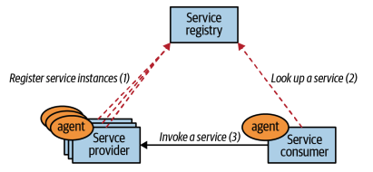
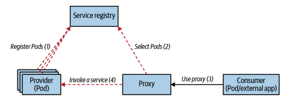
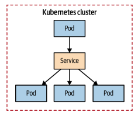
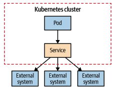
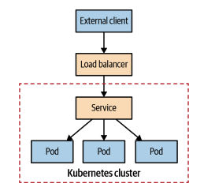
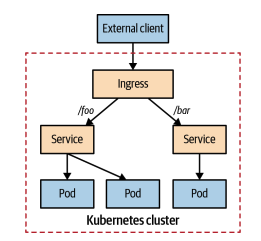
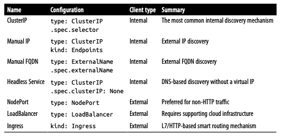

# 서비스 디스커버리
> 서비스의 클라이언트가 서비스를 제공하는 인스턴스에 접근할 수 있는 안정적인 종단점(endpoint)를 제공

## 문제
- 애플리케이션이 단독으로 존재하는 경우는 없으며, 일반적으로 클러스터 내부 혹은 외부 시스템과 상호작용해야 함
  - 파일 서버에 접속해 파일 사용
  - 메세지 브로커를 연결해 메세지를 주고 받음
  - 관계형 데이터베이스 혹은 키/값 저장소에 연결해 데이터를 읽거나 씀
- 서비스는 스케줄러에 의해 동적으로 배치되고 탄력적인 스케일 업/다운 되는 파드를 디스커버리(discovery) 하는 메커니즘이 필요

## 해결책
- 쿠버네티스가 등장하기 이전의 디스커버리 메커니즘은 클라이언트 측의 디스커버리를 통한 것
  - 서비스 컨슈머에선 서비스 인스턴스의 레지스트리를 검토하고 호출할 에이전트를 갖고 있음
  - 에이전트에서 서비스 레지스트리에 등록된 프로듀서 서비스를 조회
  - 프로듀서 서비스는 서비스 레지스트리에 등록
    
- 쿠버네티스 영역에서는 파드로 구현된 서비스 인스턴스를 동적으로 디스커버리할 수 있도록 고정된 가상 서비스(Service) 종단점을 호출
  

### 내부 서비스 디스커버리
- 서비스(Service)는 동일한 기능을 제공하는 파드 모음에 대해 일정하고 안정적인 진입점(entry point)을 제공
- 기본적으로 `clusterIP`라는 가상 IP 주소를 생성하고 자원에서 파드 셀렉터와 포트 번호를 가져와서 서비스 정의를 생성
- `service.yaml` 파일은 포트 80으로 TCP 연결을 받아들이고 셀렉터 `app: random-generator`로 설정된 모든 파트의 포트 8080으로 라우팅
  
- 서비스가 생성되면 클러스터 내에서만 접근할 수 있는 clusterIP가 할당되고, IP는 변경되지 않음
- 서비스는 L4 전송 계층 로드 밸런싱을 수행하며 네트워크 패킷을 조사하거나, HTTP 쿠키 기반 세션 어피니티와 같은 애플리케이션 레벨 로드 밸런싱을 수행할 수 없음
- 클러스터 내 애플리케이션에서 clusterIP 서비스에 디스커버리 하는 방법
  - **환경 변수를 통한 디스커버리**
    - 쿠버네티스가 파드를 가동시키면 해당 시점에 존재하는 모든 서비스의 세부 정보로 환경변수가 채워짐
    - 해당 메커니즘의 주요 문제는 시간적 의존성(temporal dependency)
    - 환경 변수는 이미 실행 중인 파드에 삽입할 수 없으므로, 서비스가 생성된 이후에 시작된 파드에 대해서만 사용 가능
    - 그렇지 않은 경우에 파드를 다시 시작
  - **DNS 참조를 통한 디스커버리**
    - 쿠버네티스는 모든 파드가 사용하도록 자동으로 설정된 DNS 서버를 운영
    - 새 서비스를 생성하면 모든 파드에서 사용할 수 있는 DNS를 할당 받음
      - `random-generator.default.svc.cluster.local`과 같은 FQDN(Fully Qualified Domain Name)으로 서비스에 도달 가능
        - random-generator: 서비스 이름
        - default: 네임스페이스 이름
        - svc: 서비스 자원
        - cluster.local: 클러스터별 접미어
    - DNS 서버는 서비스가 정의되는 즉시 모든 파드에 대한 모든 서비스를 참조(lookup)할 수 있음
  - **다중 포트**
    - 단일 서비스에서 여러 소스와 대상 포트를 지원
      - ex. 한 서비스에서 포트 80과 포트 443을 모두 노출할 수 있음
  - **세션 어피니티**
    - 기본적으로 서비스는 새 요청이 있을 경우 파드를 임의로 선택하여 연결
    - `sessionAffinity: ClientIP` 옵션을 주면 동일한 클라이언트 IP에서 오는 모든 요청에 대해 동일한 파드를 선택 (=Sticky Session)
  - **레디니스 점검**
    - 파드에 레디니스가 정의되어 있고, 실패한 경우 서비스 엔드포인트 목록에서 해당 파드는 제거
  - **가상 IP**
    - `type: ClusterIP`의 고정 가상 IP 주소는 네트워크 인터페이스에 해당하지 않으며 실제로 존재하지 않음
    - 큐브프록시(kube-proxy)에서 해당 가상 IP로 향하는 네트워크 패킷을 캡쳐해 선택된 파드 IP로 교체하는 규칙을 노드의 iptables에 업데이트
    - iptables에서 ICMP 규칙을 추가하지 않기 때문에 서비스의 IP 주소로 ping을 보낼 순 없음

### 수동 서비스 디스커버리
- `selector` 정의를 생략하고 엔드포인트 자원을 수동으로 생성해 서비스와 연결할 수 있음
  
- 엔드포인트는 파드의 IP 주소를 가질 수 있지만, 또 다른 서비스의 가상 IP 주소는 가질 수 없음
- `type: ExternalName`을 정의하여 DNS CNAME을 사용해 외부 종단점에 대한 엘리어스를 생성할 수 있음

### 클러스터 외부의 서비스 디스커버리
- 클러스터 외부에 있는 클라이언트가 파드에 접근하게 설정이 가능
- NodePort
  - `type: NodePort`로 정의
  - 서비스는 모든 노드의 전용 포트를 통한 외부 접근뿐만 아니라, 가상 IP 주소를 통한 내부 접근도 가능
  - 외부 클라이언트가 노드 포트에 접근할 수 있도록 추가 방화벽 규칙을 설정해야 할수도 있음
  - 만약 클라이언트에서 연결하는 특정 노드를 사용할 수 없다면 정상적인 노드를 연결하는 것은 클라이언트에서 해결해야 함
  - `externalTrafficPolicy: Local`을 서비스 정의에 추가해 쿠버네티스가 항상 연결이 열린 노드에서 파드를 선택하게 함으로써 추가 홉(hop)을 피할 수 있음
    - ex. 만약 해당 파드가 없는 노드가 있다면 해당 노드로의 트래픽이 있다면 트래픽을 버리게 됨
  - 클라이언트 주소는 노드 주소로 소스 NAT(SNAT)가 됨
- LoadBalancer
  - `type: LoadBalancer`로 정의
  - 클라우드 제공업체의 로드 밸런서를 사용해 외부로 서비스를 노출할 수 있음
    
  - 이용 중인 클라우드 제공업체가 제공하는 특정 구현을 확인해야 함

> 헤드리스 서비스는 전용 IP 주소를 요청하지 않고 내부 DNS 서버에 추가

### 애플리케이션 계층 서비스 디스커버리
- 인그레스(ingress)는 서비스 타입이 아니라, 서비스 앞쪽에 위치해 스마트 라우터(smart router) 및 클러스터의 진입점(entry point)역할을 하는 별도의 쿠버네티스 자원
- 외부에서 접근 가능한 URL, 로드 밸런싱, SSL 종료, 이름 기반 가상 호스팅 등을 통해 서비스에 대한 HTTP 기반 접근을 제공
- 인그레스가 작동하려면 클러스터에 하나 이상의 인그레스 컨트롤러가 필요
- 단일 외부 로드 밸런서와 IP를 재사용해 여러 서비스를 제공할 수 있어 비용 절감이 가능
- 인그레스는 동일한 IP 주소로 여러 서비스를 노출하고 모든 서비스가 동일한 L7(HTTP) 프로토콜을 사용하는 경우에 가장 유용

## 정리
- 클러스터 내에서 동적인 파드를 디스커버리하는 것은 항상 서비스 자원을 통해 수행
- 서비스는 가상 IP 주소, iptables, DNS 레코드, 환경 변수 등과 같은 하위 레벨의 세부사항을 결정하는 상위 레벨의 방식
- 캐이네이티브 서빙(Knative serving) 프로젝트는 지금까지 소개한 서비스와 동일한 종류의 새로운 서비스 자원을 도입하므로, 관심을 가질만 함

# Reference
- [Service 네트워크가 동작하는 방법](https://coffeewhale.com/packet-network3)