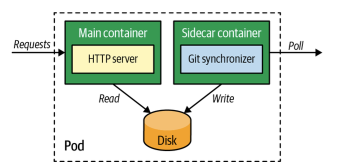

# 사이드카
> 사이드카(Sidecar) 컨테이너는 기존 컨테이너의 변경 없이 기능을 확장하고 향상시킴

## 문제
- 단일 목적의 재사용 가능한 컨테이너를 활용하려면 컨테이너의 기능을 확장하는 방법, 컨테이너 간 협업할 수 있는 수단이 필요
- 사이드카 패턴은 컨테이너가 기존에 존재하는 다른 컨테이너의 기능을 향상시키는 이러한 유형의 협업을 가능하게 만듦

## 해결책
- 파드는 컨테이너의 배포 단위로서, 파드 자신에게 속한 컨테이너들에 대해 특정 런타임 제약을 적용
  - ex. 
    - 모든 컨테이너는 동일한 노드에 배치되고 동일한 파드 수명 주기를 공유
    - 볼륨을 공유하고 로컬 네트워크 또는 호스트 IPC를 통해 서로 통신할 수 있게 허용
- 사이드카는 다른 컨테이너의 기능을 확장하고 향상시키기 위해 컨테이너를 파드에 넣는 시나리오를 기술하는데 사용
- 사이드카 패턴의 특징
  - 두 컨테이너의 관심을 분리시킴으로써 서로 다른 프로그래밍 언어를 사용하거나 릴리스 주기가 다른 팀들이 각자 별도로 컨테이너를 개발할 수 있음
  - `sidecar.yaml`
    - 
    - HTTP 서버의 치환성과 재사용성을 높여줌
    - Git 동기화 프로그램은 기타 애플리케이션이나 또 다른 설정을 적용해 파드의 단일 컨테이너로서 또는 여러 컨테이너와 협업하기 위해 재사용될 수 있음

## 정리
- 초기화 컨테이너는 컨테이너 간의 밀접한 결합이 필요하고 컨테이너 간에 상속 관계를 나타냄
- 사이드카 컨테이너는 포함 관계를 나타내며 빌드 시 컨테이너들을 결합하지 않고, 나중에 파드를 정의할 때 컨테이너를 교체할 수 있어 유연성이 뛰어남
- 컨테이너를 추가하여 기본 컨테이너의 수정 없이 파드에 직교성을 도입

> 모든 서비스가 사이드카 컨테이너를 적용한 서비스의 네트워킹, 모니터링, 트레이싱 등을 처리하는 데 많이 쓰임