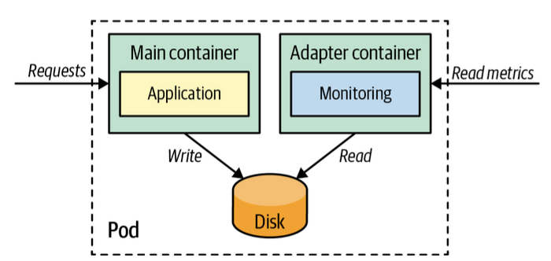

# 어댑터
> 여러 종류의 다양한 컨테이너화 시스템이 외부에서 사용할 수 있는 표준화되고 정규화된 형식의 일관된 통합 인터페이스를 준수하게 함

## 문제
- 컨테이너를 사용하면 다른 라이브러리와 언어로 작성된 애플리케이션을 통일된 방식으로 패키징하고 실행
- 팀 조직마다 각기 다른 기술을 사용하고 여러 종류의 컴포넌트로 구성된 분산 시스템을 만드는 일은 흔함
- 이러한 이질성으로 인해 모든 컴포넌트가 다른 시스템에 의해 통일된 방식으로 처리되어야 할 때 어댑터 패턴을 사용

> 어댑터 패턴은 시스템이 복잡성을 숨기고 시스템에 대한 통합된 접근을 제공

## 해결책
- 분산 시스템의 모니터링에서 어댑터 패턴을 사용하여 다양한 애플리케이션 컨테이너의 메트릭을 하나의 표준 형식 및 프로토콜로 내보냄으로써 통합된 모니터링 인터페이스를 제공
  - 
- `prometheus-adapter.yaml`
  - 난수 생성기의 로그 파일을 `Prometheus`가 예상하는 형식과 일치하지 않아 모니터링할 수 없음
  - 어댑터 컨테이너를 이용해 로그 파일을 `Prometheus` 예상할 수 있는 형식으로 변환하는 기능을 수행
  - 기본 애플리케이션이 `Prometheus`에 대해 알 필요가 없는 분리된 모니터링 설정이 가능

## 정리
- 어댑터는 사이드카 패턴을 특수화한 것

> 어댑터 패턴은 통합 인터페이스 뒤에 복잡성을 숨기고 이기종 시스템에 대한 리버스 프록시 역할을 함