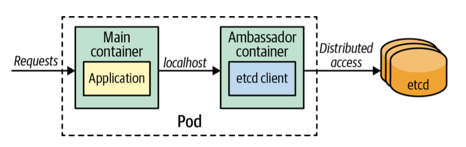

# 앰배서더
> 앰배서더 패턴은 복잡성을 숨기고 파드 외부의 서비스에 접근하는 통합 인터페이스를 제공하는 사이드카의 특수 패턴

## 문제
- 외부 서비스를 사용하려면 컨테이너에는 넣고 싶지 않은 특별한 서비스 검색 라이브러리가 필요할 수 있음
- 서로 다른 종류의 서비스 검색 라이브러리와 메소드를 사용해 서로 다른 종류의 서비스를 교환하고 싶을 수 있음

> 앰배서더 패턴의 목적은 외부에서 여러 서비스에 접근할 수 있도록 로직을 추상화하고 분리하는 것

## 해결책
- 운영 환경에서 캐시의 각 샤드에 연결할 수 있는 클라이언트 설정이 필요한 경우
- 레지스트리에서 서비스를 찾고 클라이언트 측의 서비스 검색을 수행해 해당 서비스를 이용하는 경우
- HTTP 같은 신뢰할 수 없는 프로토콜을 통해 서비스를 이용해야 하므로, 애플리케이션의 보호를 위해 circuit-breaker 로직을 사용하고, 타임아웃을 설정하며, 재시도 수행 등의 작업을 필요로 하는 경우

> 이러한 모든 경우에, 외부 서비스 접근의 복잡성을 숨기고 로컬호스트를 통해 기본 애플리케이션 컨테이너에 대한 간단한 뷰 및 접근을 제공하는 앰배서더 컨테이너를 사용

- 앰배서더 패턴을 통해 애플리케이션 컨테이너는 비즈니스 로직에 중점을 두고 외부 서비스 이용에 대한 책임과 세부사항을 다른 특수 컨테이너에 위임할 수 있음
- 다른 애플리케이션 컨테이너와 결합 가능한, 특수하고 재사용 가능한 앰배서더 컨테이너를 만들 수 있음

## 정리
> 앰배서더는 추가 기능으로 기본 애플리케이션을 보강시키지 않고, 외부 영역에 대한 스마트 프록시 역할을 함