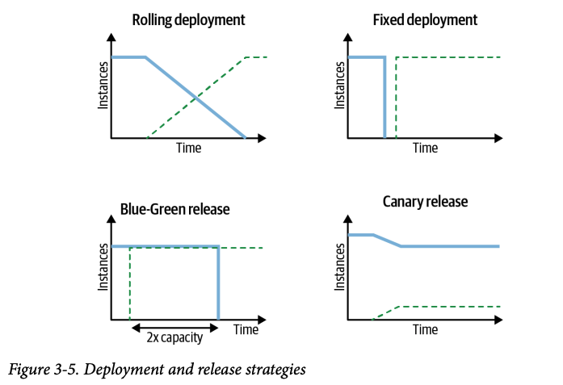

# 선언적 배포
> 디플로이먼트(Deployment)는 선언적 배포 패턴의 핵심 자원

## 문제
- 마이크로서비스 수가 증가하면 새로운 버전을 지속적으롱 업데이트하고 교체하는 것도 부담
- 새로운 버전의 파드로의 시작, 이전 버전의 파드 중지, 롤백 등 다운타임을 허용하거나 허용하지 않을 수 있음
> 이러한 단계를 수동으로 수행하다 보면 휴먼 에러가 발생하거나 적합한 스크립트를 만드는 것도 많은 공수가 필요

## 해결책
- 디플로이먼트를 활용하면 애플리케이션 업데이트 방법, 개별 전략 활용, 다양한 업데이트 프로세스 조정 등을 사용할 수 있음
- 핵심은 예측 범위 안에서 파드 세트를 시작하고 중지하는 기능
  - 예상대로 작동하려면, 컨테이너가 수명주기 이벤트를 잘 수신해야 하고 성공적으로 실행됐는지에 대한 정상상태 확인 종단점을 제공해야 함
> 컨테이너가 예측 범위의 두 영역을 정확하게 커버한다면, 이전 컨테이너를 깨끗하게 종료하고 업데이트된 인스턴스를 시작해서 이전 인스턴스로 교체할 수 있음

### 디플로이먼트
- 내부적으로 세트(set) 기반 레이블 셀렉터를 지원하는 레플리카세트(ReplicaSet)을 생성
- `maxSurge` 및 `maxUnavailable` 필드를 통해 초과 파드와 사용 가능한 파드 범위를 제어
- 장점
  - 쿠버네티스 자원 객체이기 때문에 클라이언트와 상호작용 없이 서버 측에서 실행
  - 선언적 특성을 통해 필요한 단계보다는 배포된 상태가 어떻게 보여야 하는지를 알 수 있음
  - 디플로이먼트 정의는 운영 환경에 배포되기 전에 다양한 환경에서 테스트된 실행 가능한 객체
  - 업데이트 프로세스는 모두 기록되며, 일시 중지 및 계속을 위한 옵션, 이전 버전으로 롤백을 위한 옵션으로 버전이 지정

### 롤링 배포
- 업데이트 프로세스 동안 중단이 없음을 보장
- 부작용은 업데이트 프로세스 동안 두 버전의 컨테이너가 동시에 실행된다는 것
  - 이전 버전과 호환되지 않는 변경 사항을 서비스 API에 도입하고, 클라이언트가 이를 처리할 수 없을 때 발생
  - `Recreate` 전략으로 해결 가능
- Recreate 전략
  - 우선적으로 현재 버전의 모든 컨테이너를 죽이고, 이전 버전의 컨테이너가 축출될 때 모든 신규 컨테이너를 동시에 시작
  - 이전 버전의 모든 컨테이너가 중지된 상태에서는 **다운타임 발생**

### 블루/그린 배포
- Deployment 오브젝트로 새로운 파드 레플리카셋(그린)을 미리 생성하고 트래픽은 기존 파드 레플리카셋(블루)를 유지하다가 트래픽을 전환
- 트래픽을 전환할 땐 서비스 셀렉터(Service Selector)를 그린 레플리카셋으로 일치하도록 업데이트
- 그린 레플리카셋으로 모든 트래픽이 처리되면, 블루 레플리카셋은 삭제
- 블루/그린 레플리카셋이 모두 실행되는 동안 클러스터의 자원이 2배가 소모

### 카나리아 배포
- 일부 사용자에게만 새로운 버전을 사용하게 함으로써 유연하게 배포하는 방식
- 점진적으로 트래픽을 새로운 버전으로 전환시켜 오류를 확인

## 정리
- 바로 사용 가능한 배포 전략(Rolling, Recreate)는 기존 컨테이너를 새로운 컨테이너로 교체
- 릴리스 전략(Blue/Green, Canary)는 서비스 컨슈머에게 새로운 버전이 제공