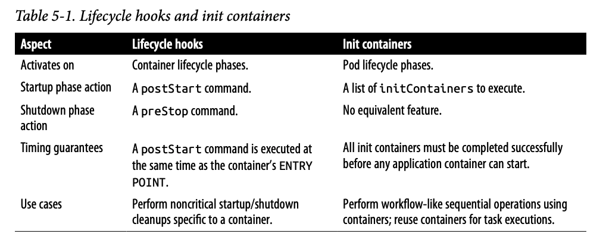

# 수명주기 관리
> 클라우드 네이티브 플랫폼으로 관리되는 컨테이너화된 애플리케이션은 자기 자신의 수명주기를 제어할 수 없어 관리 플랫폼에 의해 생성된 이벤트를 받아 수명주기를 조절해야 함

## 문제

## 해결책
- 현실세계 애플리케이션은 좀 더 세분화된 상호작용과 수명주기 관리 기능이 필요
- 실행을 준비하는 데 도움이 필요한 애플리케이션이 있고, 원만하고 깔끔한 종료 절차가 필요한 애플리케이션도 있음
- 컨테이너 수명주기 관리에 도움을 주는 초기화 컨테이너가 있음
- 이벤트와 훅(hook)은 모두 파드 레벨보다는 개별 컨테이너 레벨에 적용

### 시그텀 신호
- 시그텀이란, 시그킬(SIGKILL)신호를 보내기 전에 컨테이너가 깨끗하게 종료될 수 있도록 컨테이너를 미리 찔러 보는 것
- 쿠버네티스가 컨테이너를 멈추기로 결정할 때마다 컨테이너는 시그텀(SIGTERM)신호를 수신 
- 시그텀 신호를 받은 애플리케이션은 가능한 빨리 멈춰야 함

### 시그킬 신호
- 시그텀 신호 수신 후에도 컨테이너 프로세스가 종료되지 않는다면 다음에 따라오는 시그킬(SIGKILL)신호에 의해 강제 종료
- 시그텀 신호가 발생 후 기본적으로 유예 시간인 30초를 대기
  - `spec.terminationGracePeriodSeconds` 옵션으로 개별 파드마다 정의가 가능
  - 쿠버네티스 명령이 실행되는 동안 재정의될 수 있으므로 보장은 할 수 없음

> 수명주기 관리를 위해 프로세스 신호만 사용한 것은 다소 제한적이라, 쿠버네티스에서는 `postStart`와 `preStop` 같은 수명주기 훅을 제공
  
### 시작 후 훅(postStart)
- 컨테이너가 생성된 후 주 컨테이너 프로세스와 비동기적으로 실행
- postStart 동작은 블록킹 호출(Blocking call)이며 postStart 핸들러가 완료될 때까지는 컨테이너 상대가 대기 상태(Waiting), 파드 상태는 보류 상태(Pending)을 유지
- 주 컨테이너 프로세스의 초기화 시간을 벌기 위해 컨테이너의 시작 상태를 지연시키는 데 사용
- 또 다른 용도는 파드가 어떤 전제조건을 충족하지 못했을 때 컨테이너가 시작되지 않게 하는 것
  - ex. postStart 훅이 0이 아닌 종료 코드를 리턴해 에러를 발생시키면 컨테이너 프로세스는 종료

### 종료 전 훅(preStop)
- 컨테이너가 종료되기 전에 전송되는 블록킹 호출
- 시그텀 신호와 동일한 의미
- preStop이 블록킹되거나, 계속 진행중이거나, 실패한 결과가 리턴되더라도, 컨테이너가 삭제되거나 프로세스가 종료되는 상황을 막을 수 없음

> 훅은 컨테이너 프로세스와 병렬로 실행되기 때문에 컨테이너가 시작되기 전에 훅이 실행될 수 있으므로 주의

### 그 밖의 수명주기 제어
- 초기화 컨테이너는 일반 애플리케이션 컨테이너와는 달리 순차적으로 실행되고, 완료될 때까지 실행되며, 파드 내의 애플리케이션 컨테이너가 시작되기 전에 실행

### 정리
- 컨테이너의 시작이나 종료 명령어의 일부분으로 배시 스크립트를 사용할 수 있지만, 스크립트와 컨테이너가 밀접하게 연결되어 유지 관리가 힘들어 짐
- 쿠버네티스로 관리되는 이점이 있는 애플리케이션을 만들기 위해서는 컨테이너와 파드 수명주기의 단계 및 활용 가능한 훅을 반드시 잘 이해해야 함
- 클라우드 네이티브 플랫폼이 제공하는 주요 이점 중 하나는 애플리케이션을 신뢰성 있게 예측 가능한 범위 내에서 실행하고 확장할 수 있다는 것
- 이와 같은 이벤트를 잘 활용함으로써, 사용 중인 서비스에 미치는 영향을 최소화하고 정상적으로 시작/종료할 수 있음 

> 애플리케이션 수명주기는 사람이 통제하는 것이 아니라 플랫폼에 의해 완전 자동화되어야 한다는 사고 방식의 전환이 필요