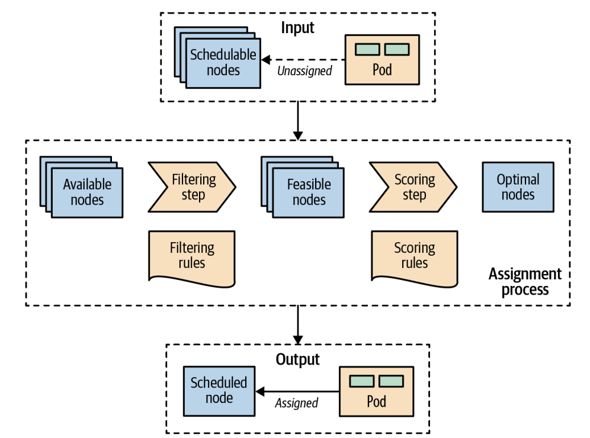

# 자동 배치
> 컨테이너 자원 요청을 만족하고 스케줄링 정책을 준수하는 노드에 신규 파드를 할당해주는 기능

## 문제
- 점점 더 많은 수로 늘어가는 마이크로서비스를 개별적으로 노드에 할당하고 배치하는 것은 관리하기 어려운 작업
- 컨테이너는 서로 간의 의존성, 컨테이너와 노드 간의 의존성, 자원 요구사항, 시간에 따른 변경사항을 가짐
- 클러스터에서 사용 가능한 자원은 시간이 지남에 따라, 클러스터를 확장/축소함에 따라, 이미 배치된 컨테이너가 자원을 소비함에 따라 다양하게 변함

> 컨테이너를 배치하는 방법은 가용성, 성능뿐만 아니라 분산 시스템의 용량에도 영향을 미침

## 해결책
- 스케줄러는 다른 쿠버네티스 컴포넌트(API 서버, 큐블릿)과 비슷하게, 하나의 독립 프로세스로 실행될 수 있거나, 전혀 사용되지 않을 수 있음
- 스케줄러가 수행하는 주요 작업은 API서버로부터 새로 생성된 파드 정의를 조회하고 파드를 노드에 할당하는 것
- 스케줄러는 초기 애플리케이션 배치, 스케일 업, 비정상 노드에서 정상 노드로 이동할 때 등 언제든 모든 파드에 대해 적절한 노드를 찾음
- 스케줄러 작업은 런타임 의존성, 자원 요구사항, 고가용성 가이드 정책에 대한 고려, 파드의 수평 확장, 상호 호출 시 성능 및 낮은 지연 시간을 위한 파드들의 가까운 배치 등을 통해 수행

> 스케줄러가 스케줄링 작업을 정확하게 수행하고 선언적 배치를 가능하게 하려면 가용한 용량을 확보한 노드와 선언된 자원 프로파일 및 가이드 정책을 갖춘 컨테이너가 필요

### 가용한 노드 자원
- 모든 노드에는 파드를 실행할 수 있는 용량이 있고, 스케줄러는 파드가 요청한 자원의 총합이 할당 가능한 노드의 용량보다 작다는 것을 확인해야 함
- 노드의 용량을 계산할 때는 아래의 공식을 이용
  ```
  애플리케이션 파드에 대한 용량(Allocatable) = 
  하나의 노드에 가용한 용량(Node Capacity)
   - 큐블릿, 컨테이너 런타임 같은 쿠버네티스 데몬(Kube-Reserved)
    - sshd, udev 같은 OS 시스템 데몬(System-Reserved)
  ```
- OS와 쿠버네티스를 관리하는 데몬의 자원을 예약하지 않으면, 파드와 시스템 데몬이 서로 자원을 사용하겠다고 경쟁하여 노드에 자원 부족 문제를 일으킬 수 있음
- 이런 제한에 대한 임시적 해결 방법은 아무 일도 하지 않는 플레이스홀더(placeholder) 파드를 실행하는 것
  - 관리되지 않는 컨테이너의 자원 사용량과 일치하는 CPU와 메모리에 대한 자원 요청이 있음
  - 추적되지 않는 컨테이너의 자원 소비를 나타내거나 예약하기 위해서만 생성

### 컨테이너 자원 요구
- 컨테이너가 런타임 의존성과 자원 요구 정의(request와 limit)를 갖는 것
- 올바른 선언으로 파드가 현명하게 노드에 할당되고 피크 타임 동안 서로 영향 없이 실행될 수 있음

### 배치(Placement) 정책
- 올바른 필터를 가지거나 특정 애플리케이션 요구에 대해 우선순위 정책에 대한 것
- 스케줄러 정책과 사용자정의 스케줄러는 오직 관리자만이 클러스터 설정으로 정의할 수 있음
- 스케줄러 정책 예제
  ```json
  {
    "Kind": "Policy",
    "apiVersion": "v1",
    "predicates": [
        {"name": "PodFitsHostPorts"},
        {"name": "PodFitsResources"},
        {"name": "NoDiskConflict"},
        {"name": "NoVolumeZoneConflict"},
        {"name": "MatchNodeSelector"},
        {"name": "HostName"}
    ],
    "priorities": [
        {"name": "LeastRequestedPriority", "weight": 2},
        {"name": "BalanceResourceAllocation", "weight": 1},
        {"name": "ServiceSpreadingPriority", "weight": 2},
        {"name": "EqualPriority", "weight": 1},
    ]
  }
  ```
- 기본 스케줄러 정책을 설정하는 것 외에도 다중 스케줄러를 띄워서 파드를 특정 스케줄러에 지정해 배치할 수 있음
  - 파드 명세에 `spec.schedulerName`를 사용

### 스케줄링 프로세스
- 파드부터 노드까지의 할당 프로세스
  
- 노드에 할당되지 않은 파드가 생성되는 즉시, 곧바로 스케줄러는 할당 가능한 모든 노드 그리고 필터링 정책과 우선순위 정책 세트와 함께 해당 파드를 선택
  
  1. 필터링 정책을 적용하고, 파드 조건에 기초해 자격 없는 모든 노드를 제거
  2. 남은 노드는 가중치에 의해 정렬
  3. 파드가 노드에 할당

- 대부분의 경우 파드부터 노드까지의 할당 작업은 스케줄러에게 맡기는 것이 좋고, 배치로직을 세세하게 관리하지 않는 편이 나음
- 일부 경우에서는 파드를 특정 노드나 노드 그룹에 강제로 할당하길 원할 수 있음
  - 노드 셀렉터(Node Selector)를 사용
  - 노드에 레이블로 존재하는 키/값 쌍의 맵이 지정되어야 함
  - 노드에 사용자 정의 레이블을 지정하는 것 외에도 모든 노드에 있는 일부 기본 레이블을 이용할 수 있음
    - `kubernetes.io/hostname` 레이블을 이용해 파드를 호스트명으로 노드에 배치할 때 사용
    - OS와 아키텍쳐, 인스턴스 타입을 나타내는 또 다른 기본 레이블도 배치에 유용하게 사용될 수 있음